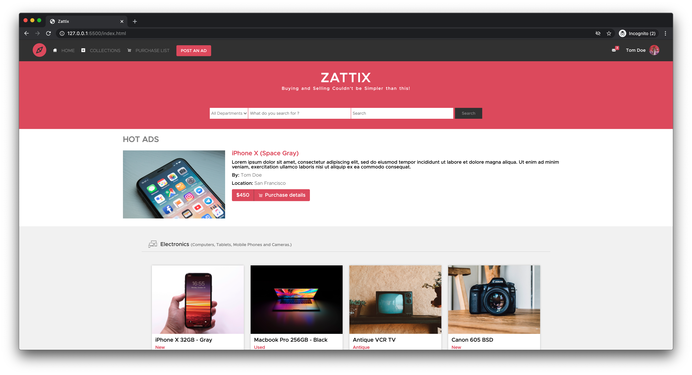
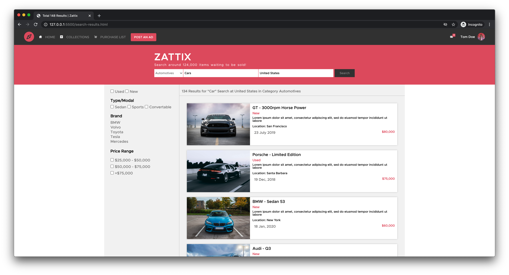

# Zattix Online Store
HTML and CSS Capstone Project based on an Online Store. The project contains a 2 pages. It contains listing for products of different categories.

> Main Page

> Results Page

## Project Requirements

* Main page (Search Page)
* Search results page
* Responsive design

## Tools Used

- HTML5
- CSS
- Unsplash Source API

## Live Demo

[Live Demo Link](https://compassionate-chandrasekhar-689ef9.netlify.app/)

## Author

👤 **Mohammad Umar**

- Github: [@mohammadumar28](https://github.com/mohammadumar28)
- LinkedIn: [Mohammed Oomer](https://www.linkedin.com/in/mohammadumar28/)
- Twitter: [@Mohammadumar28](https://twitter.com/Mohammadumar28)

## Show your support

Give a ⭐️ if you like this project!

## Acknowledgments

- [Mohammed Awad](https://www.behance.net/gallery/24796463/ZATTIX)
- The Odin Project
- Unsplash